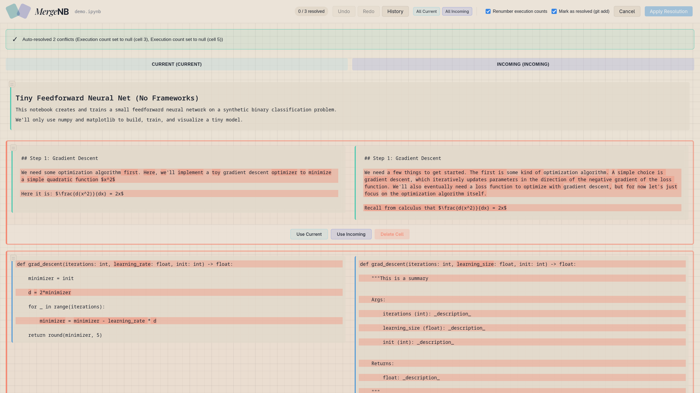
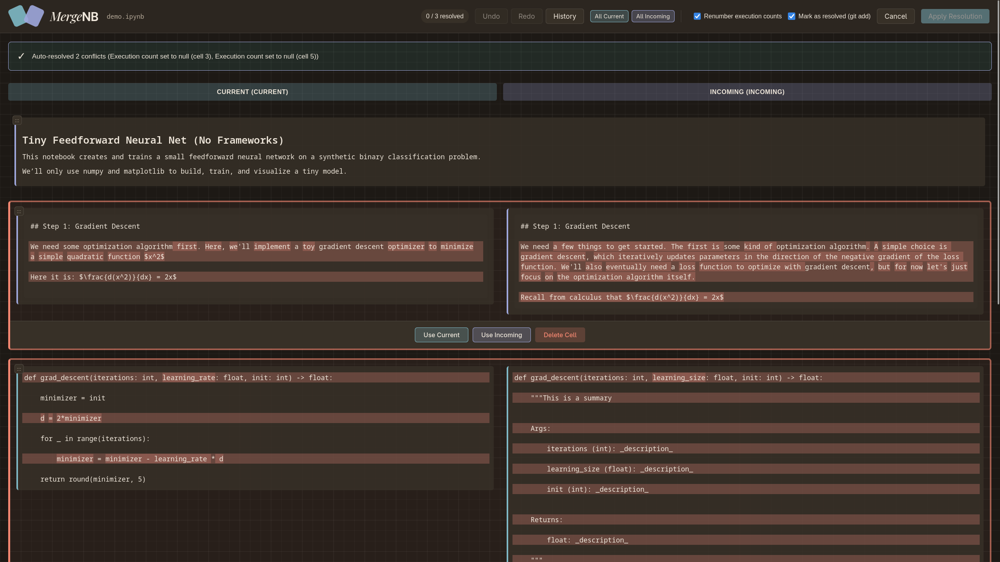

<div style={{textAlign: 'center'}}>


**Resolve Jupyter notebook merge conflicts in VS Code with a cell-aware UI.**

[](https://github.com/Avni2000/MergeNB/actions/workflows/all-tests.yml)
[](https://github.com/Avni2000/MergeNB)
[](https://code.visualstudio.com/)
[](https://www.gnu.org/licenses/gpl-3.0)
</div>

---


## Installation

Check out the Release page for the last stable version - [MergeNB Releases](https://github.com/Avni2000/MergeNB/releases) - and install the `.vsix` file from there.

Then, go to VSCode, look up "Extensions: Install from VSIX..." in the Command Palette, and select the downloaded file.

I'm a perfectionist. VSCode Marketplace listing coming soon!


## Why MergeNB? (vs nbdime)

`nbdime` is a valuable notebook diff/merge tool in the Jupyter ecosystem.

That being said, MergeNB focuses on a different experience:

### Philosophy

Keep notebook conflict resolution as simple as possible inside an existing Git workflow.

Right now, that means a VSCode + Web UI flow that works without extra Git config changes or separate CLI tools.

### Demo walkthrough:


### What stands out

- Undo/redo + full action history for complex merges.
- Fantastic handling of tested tricky scenarios (moved cells, unmatched cells, metadata conflicts).
- Interactive, cell-level conflict resolution UI.
- IDE integration via extension commands, status bar notifications, and file conflict discovery.
- Extremely active development (issues and feedback are always welcome, and feel free to email me!).

- Light and dark themes (the demo above needs to be updated!):

<div >
    <div style={{boxShadow:'0 12px 30px rgba(0,0,0,0.18)',borderRadius:'8px',overflow:'hidden',marginBottom:'32px'}}>
        
    </div>
    <div style={{boxShadow:'0 12px 30px rgba(0,0,0,0.18)',borderRadius:'8px',overflow:'hidden'}}>
        
    </div>
</div>

> [!IMPORTANT]
> MergeNB is currently **not compatible with nbdime** in the same merge flow.
> If both are active at once, merge artifacts may be produced that MergeNB cannot reliably parse.
> For best results, use one notebook merge strategy per repository/workflow.

## Commands & Usage

### 1) Open conflicted notebooks

- Command: `MergeNB: Find Notebooks with Merge Conflicts`
- ID: `merge-nb.findConflicts`
- Also available from notebook context actions and status bar when applicable.

<!-- [Screenshot: Command Palette showing "MergeNB: Find Notebooks with Merge Conflicts"] -->

### 2) Resolve in MergeNB UI

Typical flow:

1. Open a notebook in unmerged (`UU`) state.
2. Launch MergeNB command.
3. Review each conflict row.
4. Choose `base`, `current`, `incoming`, or `delete` per conflict.
5. Optionally edit the resolved source text.
6. Apply resolution and return to VS Code.


## Configuration

Extension settings (`mergeNB.*`):

### Auto resolution:

- `mergeNB.autoResolve.executionCount` (default: `true`)
    - Auto-resolve execution count differences by setting to `null`.
- `mergeNB.autoResolve.kernelVersion` (default: `true`)
    - Auto-resolve kernel/language version metadata using current branch values.
- `mergeNB.autoResolve.stripOutputs` (default: `true`)
    - Strip outputs from conflicted code cells.
- `mergeNB.autoResolve.whitespace` (default: `true`)
    - Auto-resolve whitespace-only source differences.

###  UI:

- `mergeNB.ui.hideNonConflictOutputs` (default: `false`)
    - Hide outputs for rows without conflicts.
- `mergeNB.ui.showCellHeaders` (default: `false`)
    - Show cell index/type/execution count headers in resolver UI.
- `mergeNB.ui.enableUndoRedoHotkeys` (default: `true`)
    - Enable `Ctrl/Cmd+Z` and `Ctrl/Cmd+Shift+Z` in the web resolver.
- `mergeNB.ui.showBaseColumn` (default: `false`)
    - Show the base (common ancestor) column.

## How MergeNB Resolves Conflicts

When multiple branches edit the same notebook file and then get merged, Git detects conflicts at the file level. However, since `.ipynb` files are JSON documents, Git's line-based diff/merge can produce conflicts that are difficult to interpret and resolve manually.

MergeNB applies three-way logic on matched notebook entities (`source`, `metadata`, `outputs`, `execution_count`). 

Here, we define `BASE` as the common ancestor version, `CURRENT` as the current branch version, and `INCOMING` as the incoming branch version to merge into current. The resolution logic for each entity is as follows:

```text
if CURRENT == BASE == INCOMING:
        result = any of them (all identical)
elif CURRENT == INCOMING:
        result = CURRENT  (both sides made same change, or didn't change)
elif CURRENT == BASE:
        result = INCOMING  (only INCOMING changed)
elif INCOMING == BASE:
        result = CURRENT   (only CURRENT changed)
else:
        CONFLICT  (all three differ)
```

Additional behavior:

- Uses Git unmerged stages (`:1`, `:2`, `:3`) as base/current/incoming sources.
- Detects semantic conflicts after cell matching.
- Applies configured auto-resolve policies before opening manual UI.
- Rebuilds final notebook from resolved rows and validates notebook serialization.

## Development

```bash
npm install
npm run compile
npm run lint
```

Test runner:

See `apps/vscode-extension/tests/` for VSCode host tests, `packages/web/tests/` for Playwright specs, and `test-fixtures/shared/` for shared test infrastructure.

```bash
npm run test # pick a test (or multiple) to run from an interactive menu. You can also run sandboxes from here. 
npm run test:all
npm run test:list
```

Manual testing:

See `test-fixtures/` for notebook fixtures and `apps/vscode-extension/tests/` for the test runners.

```bash 
npm run test:manual
# npm shorthand: --manual is consumed by npm, fixture values are forwarded
npm run test --manual 02
# equivalent explicit ID format 
node out/apps/vscode-extension/tests/runIntegrationTest.js --manual manual_02
# optional: override deterministic sandbox path
MERGENB_MANUAL_SANDBOX_DIR=/path/to/sandbox npm run test --manual 02
```

## Contributing

Issues and PRs are absolutely welcome.

## License

GPLv3.0 - See [LICENSE](https://github.com/Avni2000/MergeNB/blob/main/LICENSE).
