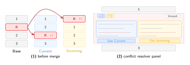
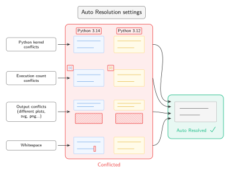
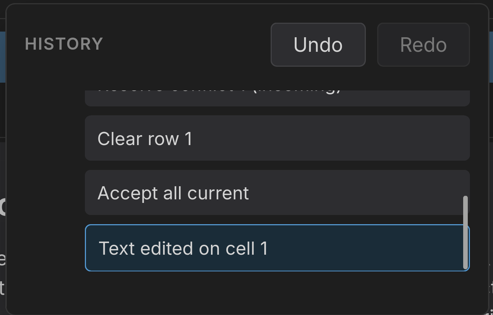

import React from 'react';
import Link from '@docusaurus/Link';
import useDocusaurusContext from '@docusaurus/useDocusaurusContext';
import styles from '../src/pages/index.module.css';
import Logo from '../src/components/Logo';

export function Hero() {
  const {siteConfig} = useDocusaurusContext();

  return (
    <section className={styles.hero}>
      

        <Logo size="large" />
        
{siteConfig.tagline}

        

          <Link className={styles.buttonPrimary} to="/playground">
            Open the playground
          </Link>
          <Link className={styles.buttonSecondary} to="/docs/installation">
            Installation
          </Link>
        

      

    </section>
  );
}

<Hero />
<main>
<section className={styles.features}>
  
  

  

  

  

  

  # Core Logic

  At the end of the day, users should be able to resolve merge conflicts intuitively, and with regard to the cell structure of their notebooks.

  ## Conflict Resolution UI

  We show a side-by-side diff of conflicting cells, with intra-cell conflicts highlighted. Users can toggle between a 2-way diff view and a 3-way diff view with the base branch as the middle column.

  

  

  

  

  

  

  

  ## Reordered Cell Handling

  We treat cell matching as a special case of the assignment problem from linear optimization/operations research.

  That is, given a weighted cost matrix of semantic distances between cells, we utilize the [Hungarian Algorithm](https://en.wikipedia.org/wiki/Hungarian_algorithm) to find the optimal matching of cells that minimizes the total distance, even in cases of reordering.

  

  

  ## Handles all Media (MIME) Types

  HTML, LaTeX, images, SVG plots, etc. We use the same rendering engine as JupyterLab to ensure that all media types are rendered correctly in the resolver, just as they would be in the notebook itself.
 
 ---
 
  # Why MergeNB?

  

    

    ## Auto-resolution

    Based on user defined settings, MergeNB can automatically resolve certain classes of conflicts without user input, such as mismatched `execution counts`, `kernel versions` or trailing `whitespace` diffs.

    ## Configurability

    [MergeNB's settings](./settings.mdx) allow users to customize their merge experience, from auto-resolution preferences to UI themes and hotkeys.
    

    

    

    

  

  

    

      
    

    

      ## Undo/Redo

      Merge resolution is hard, and mistakes are inevitable. MergeNB supports undo and redo of user actions in the resolver, as well as a full history panel allowing you to jump back and forth between any state of the resolver.
    

  

  ## Syntax highlighting

  We use [CodeMirror](https://codemirror.net/) to provide syntax highlighting in code cells, for any Jupyter-kernel-supported language (e.g. Python, Scala, R, Julia, etc.).

  --- 

  **MergeNB stands on the shoulders of all of the hardworking maintainers that came before it. Here are a few open source projects that made it possible:**
  - JupyterLab Rendermime
  - Visual Studio Code
  - CodeMirror
  - Zustand
  - KaTeX

</section>

</main>
